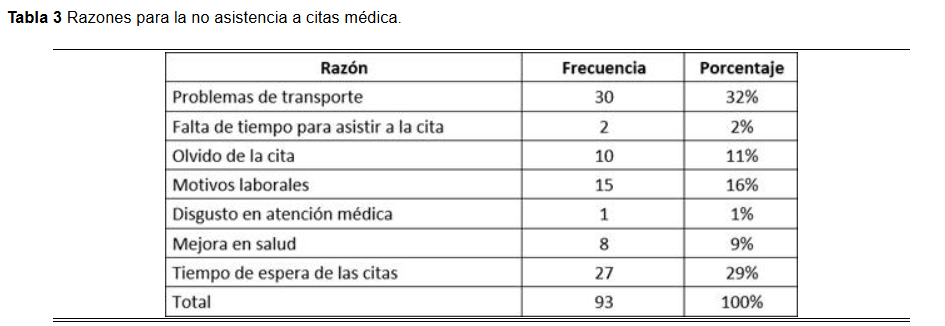
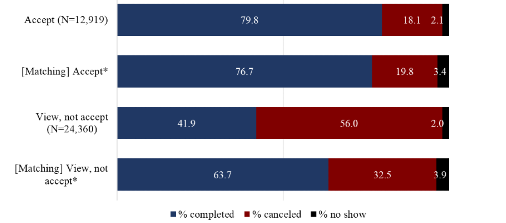
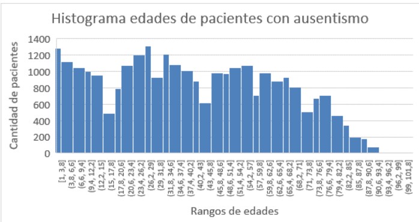
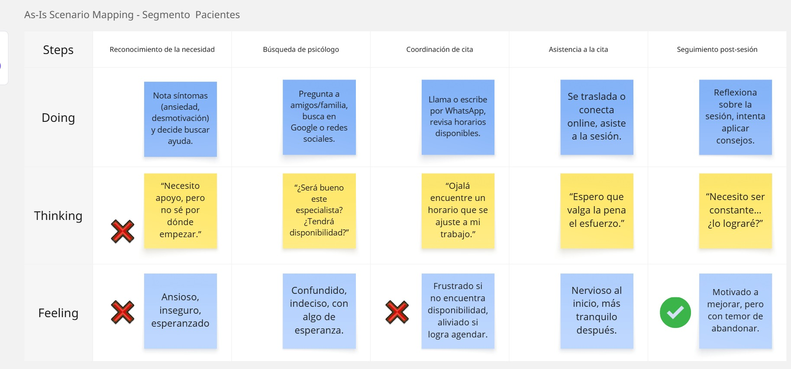
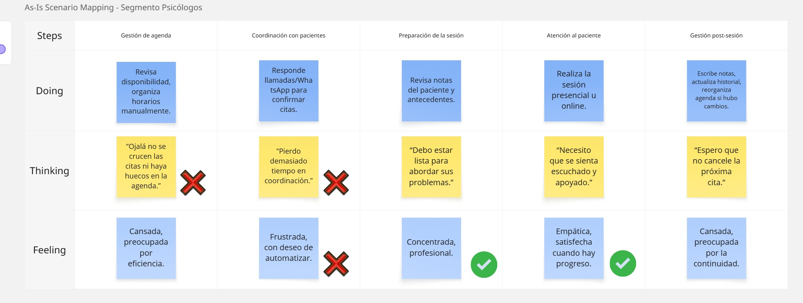

   

    

   
Universidad Peruana de Ciencias Aplicadas

    

   

    

   
<b>Ingeniería de software</b>

    

   
<b>Ciclo 2025-20</b>

    

   
<b>1ASI0657 Fundamentos De Arquitectura De Software</b>

    

   
<b>Sección:</b> 2520

    

   
<b>Profesor:</b> Delgado Vite, Jorge Luis

    

 
"Informe del Trabajo Final"

 
 

   
<b>Nombre del StartUp:</b> TechPro

    

   
<b>Nombre del Producto:</b> 

   

    

   

   <table style="margin-left: auto; margin-right: auto;">
   <tr>
   <th>Nombre</th>
   <th>Código</th>
   </tr>
   <tr>
   <td>Nombre integrante 1</td>
   <td>U</td>
   </tr>
   <tr>
   <td>Nombre integrante 2</td>
   <td>U</td>
   </tr>
   <tr>
   <td>Varela Bustinza, Marcelo Alessandro</td>
   <td>U202319668</td>
   </tr>
   <tr>
   <td>Nombre integrante 4</td>
   <td>U</td>
   </tr>
   <tr>
   <td>Nombre integrante 5</td>
   <td>U</td>
   </tr>
   </table>
   

    

   
<b>Agosto, 2025</b>

    

# Registro de Versiones del Informe

| Version | Fecha      | Autor                            | Descripción de modificación                                                                            |
|---------|------------|----------------------------------|--------------------------------------------------------------------------------------------------------|

# Project Report Collaboration Insights

URL del repositorio para el proyecto:

**Github Collaboration Insights**

# Contenido

1. [Capítulo I: Introducción](#capítulo-i-introducción) 
   1.1. [Startup Profile](#11-startup-profile) 
   1.1.1. [Descripción de la Startup](#111-descripción-de-la-startup) 
   1.1.2. [Perfiles de integrantes del equipo](#112-perfiles-de-integrantes-del-equipo) 
   1.2. [Solution Profile](#12-solution-profile) 
   1.2.1 [Antecedentes y problemática](#121-antecedentes-y-problemática) 
   1.2.2 [Lean UX Process](#122-lean-ux-process) 
   1.2.2.1. [Lean UX Problem Statements](#1221-lean-ux-problem-statements) 
   1.2.2.2. [Lean UX Assumptions](#1222-lean-ux-assumptions) 
   1.2.2.3. [Lean UX Hypothesis Statements](#1223-lean-ux-hypothesis-statements) 
   1.2.2.4. [Lean UX Canvas](#1224-lean-ux-canvas) 
   1.3. [Segmentos objetivo](#13-segmentos-objetivo) 
2. [Capítulo II: Requirements Elicitation & Analysis](#capítulo-ii-requirements-elicitation--analysis) 
   2.1. [Competidores](#21-competidores) 
   2.1.1. [Análisis competitivo](#211-análisis-competitivo) 
   2.1.2. [Estrategias y tácticas frente a competidores](#212-estrategias-y-tácticas-frente-a-competidores) 
   2.2. [Entrevistas](#22-entrevistas) 
   2.2.1. [Diseño de entrevistas](#221-diseño-de-entrevistas) 
   2.2.2. [Registro de entrevistas](#222-registro-de-entrevistas) 
   2.2.3. [Análisis de entrevistas](#223-análisis-de-entrevistas) 
   2.3. [Needfinding](#23-needfinding) 
   2.3.1. [User Personas](#231-user-personas) 
   2.3.2. [User Task Matrix](#232-user-task-matrix) 
   2.3.3. [User Journey Mapping](#232-user-task-matrix) 
   2.3.4. [Empathy Mapping](#234-empathy-mapping) 
   2.3.5. [As-is Scenario Mapping](#235-as-is-scenario-mapping) 
   2.4. [Ubiquitous Language](#24-ubiquitous-language) 
3. [Capítulo III: Requirements Specification](#capítulo-iii-requirements-specification) 
   3.1. [To-Be Scenario Mapping](#31-to-be-scenario-mapping) 
   3.2. [User Stories](#32-user-stories) 
   3.3. [Impact Mapping](#33-impact-mapping) 
   3.4. [Product Backlog](#34-product-backlog) 

# Student Outcomes
**ABET – EAC - Student Outcome 7**

| Criterio Específico | Accciones realizadas | Conclusiones | 
|---------------------|----------------------|--------------|
|La capacidad de adquirir y aplicar nuevos conocimientos según sea necesario, utilizando estrategias deaprendizaje apropiadas.|----------------------|--------------|

# Capítulo I: Introducción

## 1.1. Startup Profile

### 1.1.1. Descripción de la Startup
TechPro es una startup tecnológica creada por estudiantes de la Universidad Peruana De Ciencias Aplicadas(UPC), enfocada en desarrollar soluciones innovadoras para el ámbito de la salud mental. Nuestro objetivo es diseñar herramientas que faciliten a psicólogos y apcientes mejorar la eficiencia de la atención y brindar una experiencia más ágil y moderna mediante el uso de tecnología accesible, escalable e impulsada por inteligencia artificial.
Como empresa, buscamos generar valor en el campo del software actual, automatizando procesos rutinarios, optimizando la organización y fortaleciendo la relación terapeuta-paciente. Nuestro catálogo de soluciones está orientado a las necesidades específicas del sector, destancando una plataforma de gestión de citas psicológicas con IA que permite cooridnar horarios, sugerir el mejor emparejamiento entre paciente y profesional, enviar recordatorios automáticos y contribuir a la fidelización de los usuarios.

**Misión:**
Desarrollar y ofrecer soluciones tecnológicas innovadoras que atiendan los desafíos del sector de la salud mental, facilitando la conexión entre pacientes y psicólogos mediante inteligencia artificial. Buscamos optimizar la gestión de citas, reducir la tasa de abandono en los procesos terapéuticos y brindar herramientas accesibles que mejoren la experiencia del paciente y la eficiencia de los profesionales.

**Visión:**
Consolidarnos como la startup tecnológica de referencia en Latinoamérica en el ámbito de la salud mental, siendo reconocidos por ofrecer productos digitales basados en IA que transforman la manera en que se gestionan las citas psicológicas, se fortalecen las relaciones terapeuta–paciente y se impulsa un acceso más inclusivo y eficiente a la atención psicológica.

### 1.1.2. Perfiles de integrantes del equipo
| **Perfil**                                                                                                                                                                                                                                                                                                                                                                                                                                                                                                          | **Foto**                                     |
|---------------------------------------------------------------------------------------------------------------------------------------------------------------------------------------------------------------------------------------------------------------------------------------------------------------------------------------------------------------------------------------------------------------------------------------------------------------------------------------------------------------------|----------------------------------------------|
| **Nombre del integrante 1** Tu informacion...                                                                                                                                                                                                                                                                                                                                                                                                                                                                    |               |
| **Nombre del integrante 2** Tu informacion...                                                                                                                                                                                                                                                                                  |               |
| **Nombre del integrante 3** Tu informacion...                                                                              |               |
| **Nombre del integrante 4** Tu informacion...                                                                                                                                                                                   |               
| **Marcelo Varela** Mi nombre es Marcelo Varela. Soy un estudiante de la carrera de Ingeniería De Software, tengo 20 años y actualmente me encuentro cursando el quinto ciclo de la carrera. Me caracterizo por ser una persona responsable, resiliente y proactiva, al cual le gusta aprender sobre tecnología y el desarrollo de software. Mi compromiso como miembro de este equipo es brindar mi apoyo y participación para enfrentar lo desafíos así como dar lo mejor de mí para el éxito de este proyecto. |  |

## 1.2. Solution Profile
MindBridge es una solución integral orientada a transformar la gestión de citas psicológicas en el sector de la salud mental. A través de una plataforma digital en tiempo real impulsada por inteligencia artificial, conecta de manera eficiente a terapeutas y pacientes, optimizando la disponibilidad y reduciendo los tiempos de espera. Esta innovadora herramienta permite minimizar cancelaciones y olvidos mediante recordatorios automáticos, al mismo tiempo que facilita la captación de nuevos pacientes que requieren atención inmediata, garantizando un acceso más ágil y efectivo a los servicios psicológicos.

### 1.2.1 Antecedentes y problemática

**What (Qué)**

##### ¿Cuál es el problema?

El problema principal es la ausencia de una herramienta digital efciente para gestionar citas en tiempo real, así como la falta de un sistama personalizado que integre inteligencia artificial para reducir tiempos de espera y conectar de forma óptima a pacientes con terapeutasm al momento de administrar sus citas. Según Burgos Medina et al.(2021), la implementación de un sistema web de gestión de citas en centros psicológicos permitío disminuir los tiempos de atención y elevar los niveles de satisfacción de los pacientes evidenciando la necesidad de soluciones digitales especializadas en este sector.

##### ¿Cuál es la relación con la persona en cuestión?

MindBridge busca resolver esta problemática mediante una plataforma digital que permita a psicólogos y centros médicos gestionar de manera eficiente su disponibilidad, automatizar la organización de citas, recibir pagos en línea y fortalecer la fidelización de los pacientes. Al integrar estas funciones en un solo sistema, se optimiza la eficiencia operativa y se mejora la experiencia de quienes buscan atención psicológica. Diversos estudios, como el de Zambrano Jiménez et al. (2024), señalan que la inasistencia a citas médicas se relaciona principalmente con dificultades de coordinación y aspectos logísticos, lo cual refuerza la importancia de implementar soluciones tecnológicas que minimicen estas limitaciones y aseguren la continuidad del tratamiento.

**Who (Quién)**

##### ¿Quiénes están involucrados?

Los principales actores involucrados son los pacientes y los profesionales del sector salud, como psicólogos, terapeutas y centros especializados, que requieren una plataforma que facilite la automatización y digitalización en la gestión de citas. Del mismo modo, los pacientes buscan evitar la cancelación de sus sesiones debido a la falta de disponibilidad, garantizando así la continuidad de sus tratamientos psicológicos.

##### ¿A quiénes le sucede el problema?

El problema impacta tanto a los pacientes como a los profesionales de la salud. Por un lado, los psicólogos, terapeutas y centros especializados enfrentan dificultades para organizar su disponibilidad y reducir la inasistencia a citas; por otro lado, los pacientes ven interrumpida la continuidad de sus tratamientos debido a la falta de coordinación y tiempos de espera prolongados. Investigaciones previas, como la de Odeh, Abdelhadi y Odeh (2019), demuestran que la implementación de sistemas inteligentes y aplicaciones móviles en la gestión de citas médicas facilita significativamente el proceso de agendamiento y acceso a la atención en hospitales y clínicas.

*Where (Dónde)**

##### ¿En dónde ocurre el problema?

El problema se presenta en áreas urbanas del Perú, donde muchos profesionales del sector de la salud mental aún gestionan sus citas de manera informal, utilizando agendas físicas, mensajes de texto o redes sociales. Este tipo de administración provoca desorganización y aumenta la probabilidad de errores debido al alto número de pacientes que atienden.

##### ¿En dónde nos enfocaremos?

Nos enfocaremos en las principales áreas urbanas del Perú, donde la demanda de servicios psicológicos es cada vez mayor y los profesionales requieren herramientas digitales que faciliten la gestión de citas. Inicialmente, la plataforma estará dirigida a psicólogos independientes y centros de atención psicológica que buscan optimizar su tiempo, reducir ausencias y ofrecer a los pacientes una experiencia más accesible y organizada.

**When (Cuándo)**

##### ¿Cuándo sucede el problema?

Actualmente, esto se presenta cada vez que un cliente de nuestro segmento requiere de una cita terapéutica, y la hora y datos de la misma son administrados de forma manual o informal.

##### ¿Cuándo utiliza el cliente el producto?

Nuestros segmentos utilizarán el producto al momento de solicitar una cita psicológica. En primer lugar, el paciente podrá revisar la disponibilidad de horarios del profesional en tiempo real. Si existe un espacio accesible, la cita será registrada automáticamente en el calendario digital, evitando duplicaciones o errores. Además, el producto empleará inteligencia artificial para recomendar la mejor coincidencia entre paciente y terapeuta, enviar recordatorios automáticos que reduzcan las inasistencias y facilitar procesos complementarios como pagos en línea o reprogramaciones inmediatas en caso de cancelaciones.

**Why (Por qué)**

Existen diversas causas que originan el problema. En primer lugar, muchos profesionales aún registran sus citas de forma manual e informal, ya sea por desconfianza hacia la confiabilidad de los dispositivos tecnológicos actuales o por la falta de soluciones que realmente se adapten a sus necesidades. Otro factor está relacionado con la ausencia de calendarios digitales especializados en tiempo real para este segmento. Si bien aplicaciones como Google Calendar o Zoho ofrecen servicios similares, su complejidad y el exceso de características resultan poco prácticas para algunos profesionales de la salud mental, quienes terminan optando por anotar sus citas manualmente y registrar únicamente la información básica.

**How (Cómo)**

##### ¿En qué condiciones los clientes usan nuestro producto?

Los clientes utilizarán nuestro producto cuando necesiten agendar, confirmar o dar seguimiento a sus citas psicológicas de manera eficiente y confiable. Podrán acceder desde cualquier dispositivo con conexión a internet mediante un navegador web, lo que les permitirá consultar en tiempo real la disponibilidad de los profesionales. De esta forma, se evita la pérdida de tiempo al coordinar manualmente por llamadas o mensajes, al mismo tiempo que se reciben recordatorios automáticos que reducen olvidos e inasistencias.

**How much (Cuánto)**

##### Estadísticas que sustentan la problemática.
La inasistencia a citas médicas suele estar asociada principalmente a factores de tipo logístico y organizativo. En el estudio de Zambrano Jiménez et al. (2024) se identificó que cerca de un tercio de los pacientes (32 %) no asiste debido a problemas de transporte, mientras que un 29 % lo atribuye a los extensos tiempos de espera. Otros factores relevantes incluyen compromisos laborales (16 %) y el olvido de la cita (11 %). Estos resultados ponen en evidencia la necesidad de contar con soluciones tecnológicas que simplifiquen la gestión de citas y garanticen mayor continuidad en los tratamientos de salud mental.

Según Chung et al. (2020), la adopción de sistemas digitales como Fast Pass tiene un efecto positivo en la asistencia a las citas médicas. Los autores evidencian que, cuando los pacientes aceptan esta modalidad, la tasa de cumplimiento se acerca al 80 %, mientras que las cancelaciones y las inasistencias se reducen en comparación con las citas gestionadas de forma tradicional. En cambio, cuando la oferta es vista pero no aceptada, las citas completadas disminuyen y las cancelaciones aumentan, lo que confirma la relevancia de estas herramientas tecnológicas para mejorar la continuidad de la atención.

Tal como señalan Valenzuela-Núñez et al. (2023), el análisis de la base de datos evidencia que los grupos etarios con mayor incidencia de inasistencia corresponden a pacientes entre 1 y 15 años, seguido de un repunte significativo entre los 18 y 40 años, acumulando un total de 15.333 registros. Estos patrones permiten comprender la distribución de la problemática y constituyen un insumo clave para el desarrollo de modelos de predicción de ausentismo.

### 1.2.2 Lean UX Process

#### 1.2.2.1. Lean UX Problem Statements

Nuestra aplicación, MindBridge, está diseñada para optimizar la gestión de citas en el sector de la salud mental, permitiendo a psicólogos y centros especializados administrar su disponibilidad, conectar de manera eficiente con nuevos pacientes y mejorar la experiencia del usuario a través de inteligencia artificial y digitalización de servicios.
Hemos detectado que los profesionales de la psicología enfrentan dificultades para organizar sus citas de manera eficiente, ya que dependen de llamadas, mensajes de WhatsApp y agendas manuales, lo que genera desorden, pérdida de tiempo y altas tasas de inasistencia. Además, la falta de una herramienta centralizada limita su capacidad de crecimiento y dificulta el seguimiento de sus pacientes.
Por otro lado, los pacientes que buscan atención psicológica suelen experimentar frustración al intentar coordinar sus citas manualmente, ya que muchas veces no encuentran disponibilidad inmediata, enfrentan confusión sobre horarios y olvidan sus sesiones, lo que incrementa el abandono de las terapias.
¿Cómo podemos ofrecer una solución digital integral que permita a los psicólogos gestionar su agenda de forma eficiente, reducir las inasistencias y ofrecer a los pacientes una experiencia más accesible, confiable y personalizada en sus procesos terapéuticos?

### 2.3.2 User Task Matrix

Esta sección permite identificar las tareas clave que realizan los usuarios de los segmentos para alcanzar sus objetivos, evaluando su frecuencia e importancia. El análisis resalta coincidencias, diferencias y puntos críticos que la solución debe atender.

| Tareas                                | Carlos Méndez   Frecuencia | Carlos Méndez   Importancia | Mariana Rojas   Frecuencia | Mariana Rojas   Importancia |
|---------------------------------------|--------------------------------|--------------------------------|--------------------------------|--------------------------------|
| Buscar disponibilidad de psicólogo    | Alta                           | Alta                           | Media                          | Alta                           |
| Agendar una cita                      | Alta                           | Alta                           | Alta                           | Alta                           |
| Recordar y asistir a la cita          | Media                          | Alta                           | Alta (confirmar asistencia)    | Alta                           |
| Reprogramar o cancelar citas          | Media                          | Media                          | Alta                           | Alta                           |
| Hacer seguimiento del proceso         | Media                          | Alta                           | Media                          | Alta                           |
| Coordinar horarios por WhatsApp/llam. | Media                          | Media                          | Alta                           | Media                          |
| Captar nuevos pacientes               | –                              | –                              | Media                          | Alta                           |
| Organizar agenda semanal              | –                              | –                              | Alta                           | Alta                           |
| Confirmar asistencia de pacientes     | –                              | –                              | Alta                           | Alta                           |
| Reducir inasistencias                 | –                              | –                              | Alta                           | Alta                           |

### 2.3.4 As-is Scenario Mapping

La sección muestra cómo los usuarios experimentan actualmente la gestión de citas psicológicas, describiendo sus fases, acciones, pensamientos y emociones. Su construcción incluyó preparación, lluvia de ideas, revisión e identificación de fases, además de señalar áreas positivas, negativas y en blanco. Este análisis permite detectar fricciones y oportunidades de mejora que guiarán el diseño de la solución.

**Segmento #1: Personas con problemas de salud mental**

**Segmento #2: Psicólogos:**

# Bibliografía

Burgos-Medina, F., Tinoco-Condor, K., & Gamboa-Cruzado, J. (2021). Sistema Web para la Gestión de Citas en Centros de Atención Psicológica: Un Caso de Estudio. Revista Ibérica de Sistemas e Tecnologias de Informação, (E45), 458-473. https://www.researchgate.net/publication/391574350_Sistema_Web_para_la_Gestion_de_Citas_en_Centros_de_Atencion_Psicologica_Un_Caso_de_Estudio

Jimenez, W. F. Z., Quiroz, D. M. M., Sanchez, J. A. F., & Cevallos, S. M. Z. (2024). Determinant factors of non-attendance to medical Appointments: a mixed-methods approach. Minerva, 5(14), 52-62. https://doi.org/10.47460/minerva.v5i14.163

Valenzuela-Nunez, C. I., Espinosa, F. H. T., & Latorre-Nunez, G. O. (2023). Prediction of absenteeism in medical appointments using Machine Learning. Universidad Ciencia y Tecnología, 27(120), 19-30. https://doi.org/10.47460/uct.v27i120.728

What is Figma? (2019). Figma Learn - Help Center. https://help.figma.com/hc/en-us/articles/14563969806359-What-is-Figma

Structurizr. (2025). https://structurizr.com/

Lucidchart | Diagramas creados con inteligencia. (2025). Lucidchart. https://www.lucidchart.com/pages/es/landing?utm_source=google&utm_medium=cpc&utm_campaign=_chart_es_tier2_mixed_search_brand_phrase_&km_CPC_CampaignId=1501207844&km_CPC_AdGroupID=63362152012&km_CPC_Keyword=%2Blucidchart%20%2Bsoftware&km_CPC_MatchType=b&km_CPC_ExtensionID=&km_CPC_Network=g&km_CPC_AdPosition=&km_CPC_Creative=286846989106&km_CPC_TargetID=kwd-375017978385&km_CPC_Country=9186211&km_CPC_Device=c&km_CPC_placement=&km_CPC_target=&gad_source=1&gbraid=0AAAAADLdSjCGPJBFHw9InHN-Qfss5OfWy&gclid=Cj0KCQjwoNzABhDbARIsALfY8VPCJ6QSDWkzARgPQcf7VUOTXMJ-PZWXoYd1OdiqYtYOFsopUiaeMW8aAifbEALw_wcB

Videoconferencia, reuniones, llamadas | MicrosoftTeams. (2025). https://www.microsoft.com/es-es/microsoft-teams/group-chat-software

Build software better, together. (2025). GitHub. https://github.com/about

Domain-Driven Design for Microservices: An Evidence-Based Investigation. (2024). IEEE Journals & Magazine | IEEE Xplore. https://ieeexplore.ieee.org/abstract/document/10495888

